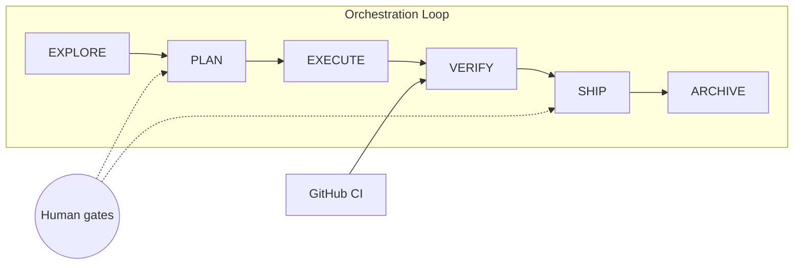

<div align="center">

# Agent Dev OS

### The operating system for AI-assisted software development in Cursor

**Planner → Executor → Evaluator** loop · **Change**-based work units · **Role Roundtable** for planning · **CI as evaluator**

[](LICENSE)
[](https://cursor.com)
[](CONTRIBUTING.md)

[Quick Start](#-quick-start) · [How It Works](#-how-it-works) · [Commands](#-command-cheatsheet) · [Compare](#-why-not-another-framework) · [Contributing](CONTRIBUTING.md)

</div>

---

## The problem

Most AI coding failures happen **between steps** — not because the model is weak:

- Plan and code bleed into one chat → context rot
- No acceptance criteria → "looks done" isn't done
- Same agent plans, implements, and reviews itself → blind spots
- Frameworks like BMAD/GSD/OpenSpec are powerful but heavy, coupled, or rigid

**Agent Dev OS** is a **copy-paste template** that gives you production-grade orchestration **natively in Cursor** — Skills, Subagents, Hooks, and GitHub Actions — without installing another CLI.

---

## What you get

| Layer | What | Survives sessions? |
|-------|------|-------------------|
| **Memory** | `PROJECT.md`, `STATE.md`, `specs/`, `constitution.md` | ✅ |
| **Work** | `changes/<slug>/` — proposal, design, tasks, spec deltas | ✅ |
| **Execution** | 12 skills, 10 role agents, hooks, CI | Runtime |



### Role Roundtable (planning only)

Inspired by [gstack](https://github.com/garrytan/gstack) — PM, CEO, Architect, Designer, Engineer, QA, Security debate **before** anyone writes code. Executor is always solo. Checker is always a **fresh chat**.

> **Roles plan. One agent builds. Another verifies.**

---

## ⚡ Quick Start

```bash
# 1. Use this template or copy into your repo
git clone https://github.com/YOUR_ORG/agent-dev-os.git my-app
cd my-app

# 2. Bootstrap (30 seconds)
./scripts/bootstrap.sh --name "My App" --stage build

# 3. Open in Cursor — start your first Change
./scripts/new-change.sh build user-auth

# 4. In Cursor chat
/route-intent          # unsure where to start
/plan-team             # full planning roundtable
/execute               # one task per fresh Agent session
/verify                # new chat + checker subagent
/ship → /archive
```

**Requirements:** [Cursor](https://cursor.com) with Agent, Plan, Ask, Debug modes · bash · git

---

## 🧠 How it works

### One loop, four intents

| Intent | When | Entry |
|--------|------|-------|
| `explore` | Research, build vs buy | `/discover-team` |
| `build` | New capability | `/plan-team` or `/plan` |
| `fix` | Bug — reproduce first | `/investigate` |
| `improve` | Refactor, no behavior change | `/plan-team --minimal` |

Depth scales with scope — not seven different playbooks.

### Fresh context rule (from GSD, simplified)

| Phase | Sessions | Writes code? |
|-------|----------|--------------|
| EXPLORE / PLAN | Many short role chats | ❌ |
| EXECUTE | **New chat per task** | ✅ executor only |
| VERIFY | **New chat** — checker | ❌ |

`STATE.md` + `tasks.md` = memory. Not chat history.

### Product stages

| Stage | Default |
|-------|---------|
| `explore` | Research, no strict CI |
| `build` | Full loop + CI |
| `operate` | fix/improve + deploy gates |

Set in `.planning/STATE.md` → `product_stage: build`

---

## 📁 Structure

```
agent-dev-template/
├── .planning/          # Vision, state, roadmap, constitution
├── specs/              # Living truth (merged on archive)
├── changes/            # Active work units
│   ├── _template/
│   └── archive/
├── .cursor/
│   ├── skills/         # /plan-team, /execute, /verify, …
│   ├── agents/         # pm, architect, checker, …
│   ├── rules/
│   └── hooks.json
├── .github/workflows/  # ci.yml, pr-check.yml
├── scripts/            # bootstrap, new-change, status
└── AGENTS.md           # Agent runtime guide
```

---

## 🎯 Command cheatsheet

### Shell (structure)

```bash
./scripts/bootstrap.sh --name "App" [--stage explore|build|operate]
./scripts/new-change.sh <explore|build|fix|improve> <slug>
./scripts/status.sh
./scripts/archive-change.sh <slug>
```

### Cursor skills (process)

| Skill | Phase |
|-------|-------|
| `/route-intent` | Router |
| `/discover-team` | EXPLORE (roundtable) |
| `/plan-team` | PLAN (roundtable) |
| `/plan` | PLAN (solo, small scope) |
| `/investigate` | FIX (reproduce first) |
| `/execute` | EXECUTE |
| `/verify` | VERIFY |
| `/ship` | SHIP |
| `/archive` | ARCHIVE |
| `/reflect` | Retro |

---

## 📊 Why not another framework?

| | BMAD | Spec Kit | GSD | OpenSpec | **Agent Dev OS** |
|---|:---:|:---:|:---:|:---:|:---:|
| Cursor-native | ◐ | ◐ | ◐ | ◐ | ✅ |
| No extra CLI | ❌ | ◐ | ❌ | ❌ | ✅ |
| Role planning | ✅ | ◐ | ◐ | ◐ | ✅ |
| Change deltas | ◐ | ◐ | ◐ | ✅ | ✅ |
| Fresh executor | ◐ | ◐ | ✅ | ◐ | ✅ |
| CI verification | ◐ | ◐ | ◐ | ◐ | ✅ |
| Brownfield | ◐ | ❌ | ◐ | ✅ | ✅ |

*Synthesis of what works — not a replacement runtime.*

---

## 🪜 Maturity levels

| Level | You add | When |
|-------|---------|------|
| **L1** | This template | Day 1 |
| **L2** | Hooks + subagents + CI | First shipped Change |
| **L3** | PR agent review, automations | Production |
| **L4** | Worktrees, parallel Changes | 3+ parallel streams |

---

## 🔌 Optional: gstack extension

Want Garry Tan's full 23-skill sprint workflow?

```bash
./scripts/bootstrap.sh --name "App" --with-gstack
```

See [docs/gstack-mapping.md](docs/gstack-mapping.md) for skill mapping. Core template works standalone.

---

## 🛡️ Safety built in

- **careful** — ask before destructive ops
- **freeze** — stay inside active Change scope  
- **guard** — no force-push, no self-merge, no fix without reproduction

Hooks block dangerous git commands. Checker runs in isolation.

---

## 🤝 Contributing

PRs welcome! See [CONTRIBUTING.md](CONTRIBUTING.md).

1. Fork → test on a real mini-project → PR
2. Keep it **universal** (no domain-specific business logic)
3. Keep it **lean** (no new CLI dependencies)

---

## 📚 References

- [Planner-Executor-Evaluator patterns](https://agentengineering.org/articles/supervisor-router-and-planner-executor-patterns/)
- [Cursor Skills](https://cursor.com/docs/skills) · [Subagents](https://cursor.com/docs/subagents) · [Hooks](https://cursor.com/docs/hooks)
- [gstack](https://github.com/garrytan/gstack) — role patterns (optional extension)

---

## License

MIT — use freely, attribution appreciated.

<div align="center">

**⭐ Star this repo if it saves you from context rot**

*Built for teams who ship with Cursor, not despite it.*

</div>
