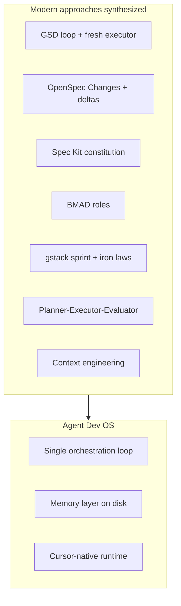

# The Synthesis — How Agent Dev OS Combines Modern Approaches

Agent Dev OS is not another framework to install. It is a **curated synthesis** of what production teams and research (2025–2026) converged on — implemented **natively in Cursor**, without vendor lock-in.

> **No single methodology wins.** The best teams borrow orchestration from GSD, specs from OpenSpec, governance from Spec Kit, roles from BMAD and gstack, and evaluation from industry P-E-E patterns — then wire it into their editor.

---

## What we studied

| Source | What the community learned |
|--------|---------------------------|
| [Planner–Executor–Evaluator](https://agentengineering.org/articles/supervisor-router-and-planner-executor-patterns/) | Most agent failures happen **between steps**, not inside the model |
| [Framework comparison (arxiv 2606.04967)](https://arxiv.org/html/2606.04967v1) | No framework scores 12/12 — strengths are complementary |
| [GSD](https://github.com/gsd-build/get-shit-done) | Fresh executor per task; `STATE.md`; Discuss→Plan→Execute→Verify loop |
| [OpenSpec](https://github.com/Fission-AI/OpenSpec) | **Change** as work unit; spec deltas; brownfield-friendly |
| [Spec Kit](https://github.com/github/spec-kit) | `constitution.md`; human gates on greenfield |
| [Spec Kitty](https://github.com/spec-kitty/spec-kitty) | Review before merge; worktrees for parallel changes |
| [BMAD](https://github.com/bmad-code-org/BMAD-METHOD) | Role-based planning; progressive context |
| [gstack](https://github.com/garrytan/gstack) | Sprint loop; office-hours PM; scope modes; iron-law debug |
| [Anthropic — context engineering](https://www.anthropic.com/engineering/effective-context-engineering-for-ai-agents) | Memory on disk, not in chat; just-in-time context |
| **Cursor platform** | Skills, Subagents, Hooks, Modes, Automations, CLI |

---

## Take / leave matrix

| Source | ✅ We take | ❌ We leave |
|--------|-----------|------------|
| **GSD** | Orchestration loop, fresh context per task, `STATE.md`, parallel waves | 50+ slash commands, vendor coupling |
| **OpenSpec** | Change folders, spec deltas (ADDED/MODIFIED/REMOVED), archive audit trail | CLI as required dependency |
| **Spec Kit** | `constitution.md`, human approval gates | Rigid phase locks, greenfield-only bias |
| **Spec Kitty** | Review gates, worktrees (L4 maturity) | Full CLI install |
| **BMAD** | Role personas, separation of concerns in planning | 12+ agents, heavy install footprint |
| **gstack** | PM office-hours, CEO scope modes, investigate iron law, checker review | 23 skills wholesale, Bun-specific chains |
| **P-E-E industry** | Planner / Executor / Evaluator as distinct sessions | LangGraph-style runtime (overkill for template) |
| **Cursor** | Skills = loop steps, Subagents = roles, Hooks = gates, CI = evaluator | — |

---

## One loop, many influences

### Unified sprint mapping (gstack ↔ Agent Dev OS)

| gstack | Agent Dev OS | Origin |
|--------|--------------|--------|
| Think | EXPLORE | gstack + BMAD discovery |
| Plan | PLAN + Role Roundtable | gstack + BMAD + Spec Kit gates |
| Build | EXECUTE | GSD fresh executor |
| Review | VERIFY + checker | gstack `/review` + P-E-E Evaluator |
| Test | VERIFY + qa + CI | gstack `/qa` + Spec Kitty gates |
| Ship | SHIP | gstack + GitHub Actions |
| Reflect | ARCHIVE + `/reflect` | gstack `/retro` + OpenSpec archive |

---

## Design principles of the synthesis

1. **One process, variable depth** — four intents (`explore`, `build`, `fix`, `improve`), not seven job types
2. **Change = unit of work** — every effort gets proposal, design, tasks, spec delta (OpenSpec)
3. **Roles plan, executor builds, checker verifies** — maker-checker (gstack + P-E-E)
4. **Memory survives sessions** — `STATE.md`, `specs/`, `changes/` (GSD + context engineering)
5. **Human gates where judgment matters** — scope, architecture option, merge (Spec Kit)
6. **CI is the production evaluator** — local hooks + GitHub Actions (Spec Kitty)
7. **No extra CLI** — skills in `.cursor/skills/`, not npm global tools
8. **Brownfield first** — spec deltas, not rewrite-the-world PRDs (OpenSpec)

---

## Why synthesis beats picking one framework

| If you only use… | You miss… |
|------------------|-----------|
| GSD alone | Role roundtable, spec deltas, CI packaging |
| OpenSpec alone | Orchestration loop, fresh executor, role personas |
| BMAD alone | Lean install, Cursor-native hooks, change archive model |
| gstack alone | Universal domain, brownfield deltas, optional not mandatory |
| Raw Cursor | Persistent memory, loop discipline, acceptance criteria |

**Agent Dev OS** = the intersection set, trimmed to what fits in a copy-paste template.

---

## Optional extensions (not required)

- **[gstack](https://github.com/garrytan/gstack)** — full Garry Tan 23-skill sprint ([mapping](gstack-mapping.md))
- **Cursor Automations** — CI babysit, inbox-driven fixes (L3)
- **Worktrees** — parallel Changes (L4, Spec Kitty pattern)

Core template ships **lean**. Extend when your team matures — don't pay complexity tax on day one.
